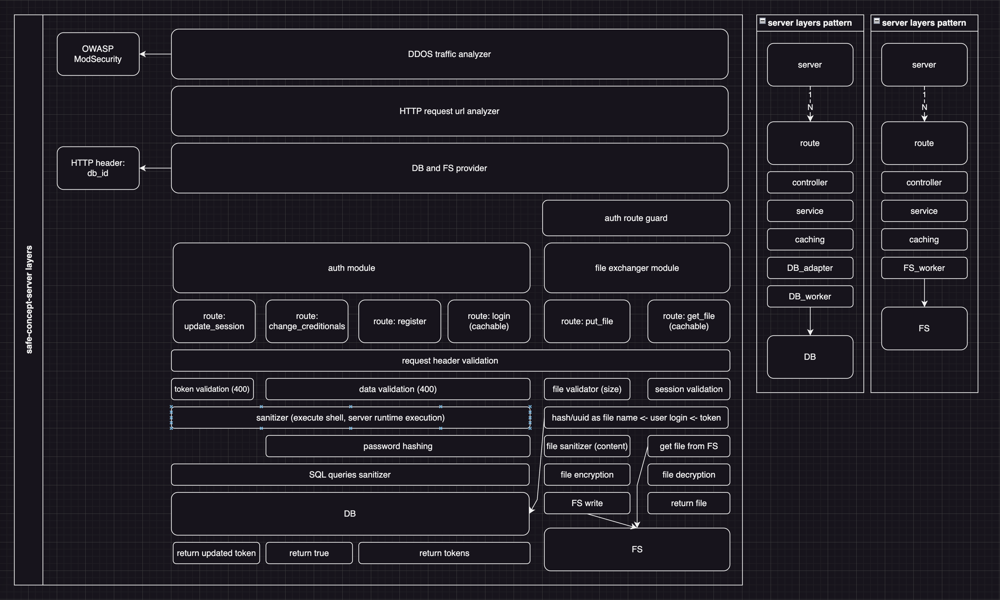

# safe-concept-server

## concept of project
each authorized user owns an encrypted file with application data.

server implements DDOS protection, code, SQL injections and provides file storage.
one user - one encrypted file.

this concept supports the use of multiple applications.

it's assumed it will be used by standalone client applications that can storage user data in a single file. without application global or overlapped data.

## project layers architecture


## project folder architecture
- server;
	- libs (common tools):
		- domain (lib is linked by domain zone);
			- index (export tools);
			- tools;
		- index (export tools);
	- middleware:
		- CORS;
		- DDOS-traffic-analyzer;
		- HTTP-requests-analyzer;
		- DB-provider;
		- FS-provider;
	- guards:
		- guard;
	- routes:
		- module:
			- route-name (DB);
				- controller (works with request);
				- service (works with data);
				- caching service;
				- DB_adapter (multiple DB supporting);
				- DB_worker (SQL query sender);
			- route-name (FS);
				- controller;
				- service;
				- caching (only get_file);
				- FS_worker;

## Development
1 set .env file:
```bash
cp .env.example .env
```

2 change vars in .env for your OS and preferences;

3 to run server (go needed):
```bash
./run-server.sh
```

3 to build server
```bash
./build-server.sh
```

after that you can launch builded binary file:
```bash
./build/server
```
